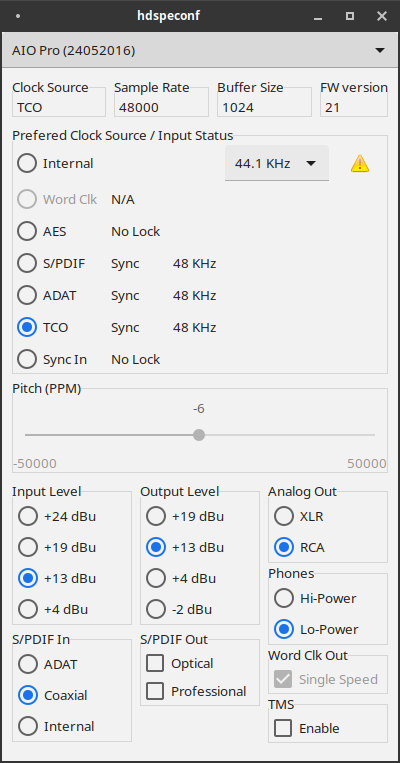

# AIO Pro configuration

Left-to-right, top-to-bottom:

**Clock Source**

Current clock source of the audio card:
- "Master": when running the card in master clock mode. 
- "Internal": when not running the card in master clock mode, but no valid external synchronisation reference if available. 
- "Word Clk": word clock input.
- "AES": AES-3 digital audio input.
- "S/PDIF": S/PDIF digital audio input.
- "ADAT": ADAT digital audio input.
- "TCO": Time Code Option module.
- "Sync In": intra-computer synchronisation signal jumper on the sound card.

**Sample Rate**

Current effective sound card sample rate in audio frames per second. May differ slightly from standard rates (32000, 44100, 48000, 64000, 88200, 96000, 128000, 176400, 192000) for external clock source, or due to non-zero pitch setting. If non-standard, this field changes color into alarming orange.

**Buffer Size**

PCM data is handed from the sound card to the system or vice versa in buffers of this many samples. Together with the sample rate, the buffer size determines the latency between incoming and outgoing PCM data. At 48000Hz, a buffer size of 128 samples leads to 2.7 milliseconds capture latency. Playback latency is usually twice that.  A smaller buffer size leads to lower latency and, vice versa, a larger buffer size will cause higher latency. Small buffer sizes also increase audio card interrupt rate and, if too small given the processing speed of a computer system and its load, will cause X-Runs (buffer under- or overruns). X-Runs are perceived as disturbing clicking noises during playback and short gaps of silence in recordings. On modern systems, buffers sizes as small as 64 samples will generally work well at single speed sample rate (32000, 44100 or 48000 Hz). 128 and 256 will do for double resp. quadruple speed modes. The minimum is 32 samples. The maximum is 4096 samples. Buffer size is set by linux ALSA during PCM initialisation. It cannot be set using hdspeconf.

**FW version**

Sound card firmware version. Take note of firmware version when reporting issues with the hdspe driver or hdspeconf.

**Preferred Clock Source / Input Status**

The radio buttons enable to set the preferred clock source. Select "Internal" to use the sound card in master clock mode. If the selected preferred clock source is not available or valid, the sound card will use a next clock source. The actual clock source used is reported at any time in the **Clock Source** field.

For each potential clock source, sync status is indicated: 
- "N/A" means the source hardware (Word Clock module, if a TCO card is present, and TCO otherwise) is not available. The card does not report whether or not an optional Word Clock Module is present or not. If neither TCO nor WCM are present, Word Clock status will show as "No Lock" and TCO as "N/A".
- "No Lock" mean no valid signal is detected on the source. 
- "Lock" means a valid signal is detected on the source, but it is not compatible with the current clock source.
- "Sync" means a valid signal is detected on the source, and the signals sample rate is compatible with the current clock source.

While being live, it is safe to switch preferred clock source to a source with "Sync" status. Switching to other clock source may result in sudden sample rate changes and clicks and noises.

The panel also indicates the detected sample rate on external sources with valid signal ("Lock" or "Sync" status), and warns about sources with sample rate not compatible with the current source by displaying a warning sign.

The internal sample rate is set by linux ALSA during PCM initialization. It cannot be set using hdspeconf is some audio application is using the card. hdspeconf only allows changing the sample rate if no application is running. The setting may be overridden by ALSA tools after, though.

**Pitch**

Displays the current source sample rate pitch relative to the nearest standard sample rate, in parts per million. 

If running in master mode, pitch can also be changed manually. It changes sample rate and tune at the same time, during recording and playback. This may be useful to align with other sources and for creative effects. It allows to tune / de-tune the entire DAW, e.g. to match instruments which cannot be tuned. The slider can be moved using the mouse, or the arrow up/down or page up/down keyboard keys allow changing the pitch to common values. Use the keyboard keys to precisely reset to 0.

**Input Level**

Sets the analog input sound level (dBu units) corresponding to full scale digital level. In broadcasting, +4 dBU is a standard setting. The other settings allow to additional head-room while recording.

**Output Level**

Sets the analog output sound level (dBu units) corresponding to full scale digital level. In broadcasting, +4 dBU on XLR is a standard setting. Other settings allow to output higher or lower analog sound levels. The actual levels depend on the **Analog Out** setting.

**Analog Out**

Switches output levels depending on whether outputting balanced audio, over XLR, or unbalanced output, over RCA. This setting shall be set according to what analog audio break-out cable (XLR or RCA) is mounted on the sound card.

**Phones**

Sets to head-phone output level. "Lo-Power" offers reduced background noise on highly sensitive headphones.

**S/PDIF In**

Selects the hardware S/PDIF input:
- "Optical": take S/PDIF from the TOSLINK input connector (otherwise used for ADAT input).
- "Coaxial": take S/PDIF from the white RCA connector on the digital audio break-out cable.
- "Internal": take S/PDIF from the internal S/PDIF input jumper on the sound card, useful to connect the sound card to an internal CD player, for instance.

**S/PDIF Out**

- "Optical": output S/PDIF on the TOSLINK output connector (otherwise used for ADAT output).
- "Professional": select professional S/PDIF output. If not selected, "Consumer" S/PDIF output is generated.

**Word Clk Out**

- "Single Speed": if selected, single-speed word clock output is generated even if the card is running at double or quadruple sample rates. If not selected, word clock output will follow the speed mode of the card.

The TCO module only supports single speed word clock output. When the TCO module is present, this setting is always enabled and cannot be changed.

**TMS**

Activates the transmission of Channel Status data and Track Marker information from the S/PDIF and AES input, in the least significant bits of audio samples. On other platforms, such data and information is analyzed by RME's DIGICheck application.

