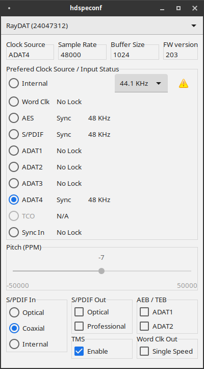

# RayDAT configuration

Top-to-bottom, left-to-right:

**Clock Source**

Current clock source of the audio card:
- "Master": when running the card in master clock mode. 
- "Internal": when not running the card in master clock mode, but no valid external synchronisation reference if available. 
- "Word Clk": word clock input.
- "AES": AES-3 digital audio input.
- "S/PDIF": S/PDIF digital audio input.
- "ADAT1": ADAT1 digital audio input.
- "ADAT2": ADAT2 digital audio input.
- "ADAT3": ADAT3 digital audio input.
- "ADAT4": ADAT4 digital audio input.
- "TCO": Time Code Option module.
- "Sync In": intra-computer synchronisation signal jumper on the sound card.

**Sample Rate**

Current effective sound card sample rate in audio frames per second. May differ slightly from standard rates (32000, 44100, 48000, 64000, 88200, 96000, 128000, 176400, 192000) for external clock source, or due to non-zero **pitch** setting. If non-standard, this field changes color into alarming orange.

**Buffer Size**

PCM data is handed from the sound card to the system or vice versa in buffers of this many samples. Together with the sample rate, the buffer size determines the latency between incoming and outgoing PCM data. At 48000Hz, a buffer size of 128 samples leads to 2.7 milliseconds capture latency. Playback latency is usually twice that.  A smaller buffer size leads to lower latency and, vice versa, a larger buffer size will cause higher latency. Small buffer sizes also increase audio card interrupt rate and, if too small given the processing speed of a computer system and its load, will cause X-Runs (buffer under- or overruns). X-Runs are perceived as disturbing clicking noises during playback and short gaps of silence in recordings. On modern systems, buffers sizes as small as 128 samples will generally work well at single speed sample rate (32000, 44100 or 48000 Hz). 256 and 512 will often do for double resp. quadruple speed modes. The minimum is 64 samples. The maximum is 4096 samples. Buffer size is set by linux ALSA during PCM initialisation. hdspeconf only reports it.

**FW version**

Sound card firmware version. Take note of firmware version when reporting issues with the hdspe driver or hdspeconf.

**Preferred Clock Source / Input Status**

The radio buttons enable to set the preferred clock source. Select "Internal" to use the sound card in master clock mode. If the selected preferred clock source is not available or valid, the sound card will use a next clock source. The actual clock source used is reported at any time in the **Clock Source** field.

For each potential clock source, sync status is indicated: 
- "N/A" means the source hardware (Word Clock module, if a TCO card is present, and TCO otherwise) is not available. The card does not report whether or not an optional Word Clock Module is present or not. If neither TCO nor WCM are present, Word Clock status will show as "No Lock" and TCO as "N/A".
- "No Lock" mean no valid signal is detected on the source. 
- "Lock" means a valid signal is detected on the source, but it is not compatible with the current clock source.
- "Sync" means a valid signal is detected on the source, and the signals sample rate is compatible with the current clock source.

While being live, it is safe to switch preferred clock source to a source with "Sync" status. Switching to other clock source may result in sudden sample rate changes and clicks and noises.

The panel also indicates the detected sample rate on external sources with valid signal ("Lock" or "Sync" status), and warns about sources with sample rate not compatible with the current source by displaying a warning sign.

The internal sample rate is set by linux ALSA during PCM initialization. hdspeconf only allows changing the sample rate if no application is playing or recording audio on the card. Keep in mind this setting will probably be overridden by audio applications or ALSA tools after.

**Pitch**

Displays the current sound card sample rate deviation from the nearest standard sample rate, in parts per million (PPM). 

Pitch can be set when running in master mode: It changes sample rate and tune at the same time, during recording and playback. This may be useful to align with other sources and for creative effects. It allows to tune / de-tune the entire DAW, e.g. to match instruments which cannot be tuned. The slider can be moved using the mouse. Arrow up/down or page up/down keyboard keys allow changing the pitch to common values, including resetting precisely to zero.

**S/PDIF In**

Selects the S/PDIF input connector to use:
- "Optical": take S/PDIF from the ADAT4 TOSLINK input connector (otherwise used for ADAT4 input).
- "Coaxial": take S/PDIF from the white RCA connector on the digital audio break-out cable.
- "Internal": take S/PDIF from the internal S/PDIF input jumper on the sound card, useful to connect the sound card to an internal CD player, for instance.

**S/PDIF Out**

- "Optical": output S/PDIF on the ADAT4 TOSLINK output connector (otherwise used for ADAT4 output). If not selected, S/PDIF output is produced on the red RCA connector of the digital audio breakout cable.
- "Professional": selects professional format S/PDIF output. If not selected, consumer format S/PDIF output is produced.

**AEB / TEB**

Selecting ADAT1 causes ADAT1 to be sourced from the internal
ADAT1 / SPDIF ("CD in") connector instead of the ADAT1 optical connector. Select
this if you have an AEB or TEB expansion board connected to that internal
ADAT1 connector.

Similarly, selecting ADAT2 causes ADAT2 to be sourced from the internal ADAT2
connector instead of the ADAT2 optical connector. Select this if you have an
AEB or TEB expansion board connected to that ADAT2 internal connector.

*Note: RME is no longer manufacturing the AEB or TEB expansion boards*

**Word Clk Out**

- "Single Speed": if selected, single-speed word clock output is generated even if the card is running at double or quadruple speed (64000 and above sample rates). If not selected, word clock output will follow the speed mode of the card.

The optional TCO module only supports single speed word clock output. When the TCO module is present, this setting is always enabled and cannot be changed.

**TMS**

Activates the transmission of Channel Status data and Track Marker information from the S/PDIF and AES input, in the least significant bits of audio samples. On other platforms, such data and information is analyzed by RME's DIGICheck application.

**More information**

See [RME's HDSPe RayDAT user guide](https://www.rme-audio.de/downloads/raydat_e.pdf) for more information.

