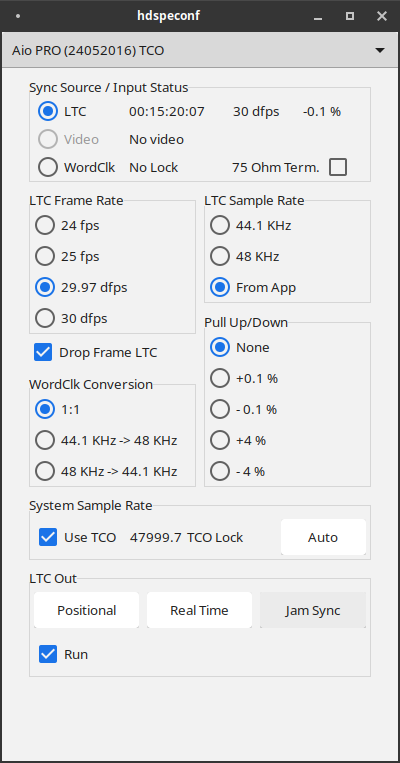

# Time Code Module (TCO) configuration

Top-to-bottom, left-to-right:

**Sync Source / Input Status**

The radio buttons select synchronisation source:
- "LTC": LTC input.
- "Video": TCO video input.
- "WordClk" TCO word clock input.

Alongside, input status for each of the synchronisation sources is displayed:
- LTC: current LTC (last processed code incremented by 1 frame), LTC frame rate and format (drop frame or non-drop frame), and deviation of the LTC frame rate from the rate class (24, 25 or 30 fps) as measured by the driver. The deviation, or effective "pull factor" is displayed in percentage units. It is not displayed if zero.
- Video: video format detected by the hardware: "PAL", "NTSC" or "No Video".
- WordClk: incoming word clock signal status and speed: "No Lock", "Single Speed", "Double Speed", "Quad Speed".

- "75 Ohm Term.": selecting this checkbox terminates the world clock BNC adapter with a 75 Ohms resistance. The yellow LED on the bracket lights up when termination is active.

**LTC Frame Rate**

Sets the LTC engine frame rate: 24, 25, 29.97 or 30 LTC frames per second. This affects sound card synchronisation sample rate from LTC input, as well as LTC output frame rate. For LTC input, this setting shall match the incoming LTC frame rate. The **Auto button** in the System Sample Rate box sets it so.

**Drop Frame LTC**

Select this box to output drop frame (DF) format LTC. When not selected, non-drop frame (ND) format time code is produced. Drop frame time code is time code in which frames 0 and 1 of the first second of every minute, except multiples of 10 minutes, are skipped. Drop frame time code was invented in order to keep LTC time codes more or less in sync with wall clock time at a LTC frame rate of 29.97 fps.

**LTC Sample Rate**

Sets the LTC engine sample rate: 44.1 or 48 KHz are supported. Selecting "From App" will adapt to the internal sample rate class of the sound card.  32 KHz is *not* supported, and will translate into a LTC engine sample rate of 44.1 KHz. This setting affects both the sound card synchronisation sample rate from LTC input as well as LTC output. For LTC output, this setting shall match the audio cards sample rate. The **Auto button** in the System Sample Rate box sets this setting to "From App", in order to match the internal sample rate of the sound card.

**Pull Up/Down**

Sets the TCO engine pull up/down factor, in order to match NTSC or PAL input (+0.1% or -0.1%) or for 24/25 fps frame rate conversions. This setting shall match the effective pull factor of incoming LTC, and is set as such by the **Auto button** in the System Sample Rate box. This setting also affects the sound card synchronisation sample rate when synchronising with word clock input in "1:1" sample rate conversion mode. It does not affect LTC output.

**WordClk Conversion**

This setting controls the conversion of world clock input from 44.1 KHz to 48 Khz, or vice versa. For instance, set it to "44.1 KHz -> 48 KHz" in case your word clock input is 44.1 KHz and you want to use it to synchronise your sound card running at 48 KHz sample rate. If no rate conversion is needed, set it to "1:1". This setting only affects sound card synchronisation sample rate based on word clock input. It does not affect the LTC engine.

**System Sample Rate**

- "Use TCO": selecting this checkbox sets the preferred clock source of the sound card to use the TCO. Unselecting this box, resets the sound card in master clock mode. 

Next, the actual sound card sample rate is displayed, to 0.1 Hz accuracy, as well as the TCO module lock status. The sample rate is displayed in alarming orange color if non-standard, just like the effective sound card sample rate on the main sound card configuration dialog. 

If the TCO has no valid synchronisation signal, "No TCO lock" is displayed, again in alarming orange color.

TCO lock status is also reflected by the green LED on the TCO module bracket.

**Auto button**

The "Auto" button changes the settings of the LTC engine to match the incoming LTC signal, if valid LTC input is present. It sets **LTC Sample Rate**, **Drop Frame LTC** and **Pull Up/Down**. **LTC Sample Rate** is set to "From App". This button is a user-friendly one-push way to set-up the TCO for correct sound card synchronisation with LTC input.

**LTC Out**

Start/stop LTC output:
- "Positional": start LTC output with positional LTC. Positional LTC is 00:00:00:00 at audio sample count 0, i.o.w. at the time the sound card driver was loaded and activated on the system. It corresponds to the LTC output generated by the microsoft windows driver.
- "Real Time": start LTC output with wall clock time: the time reported by the systems real-time clock, corrected for time zone and daylight saving time.
- "Jam Sync": starts LTC output to match LTC input. 
- "Run": unselecting this checkbox pauzes LTC output. LTC output is re-started from the pauzed time code when checked again.

Note that LTC output will slowly drift away from the clock source it was started with, unless input and output are kept synchronised in some way.

